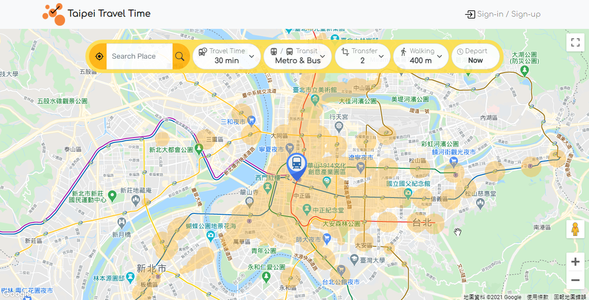
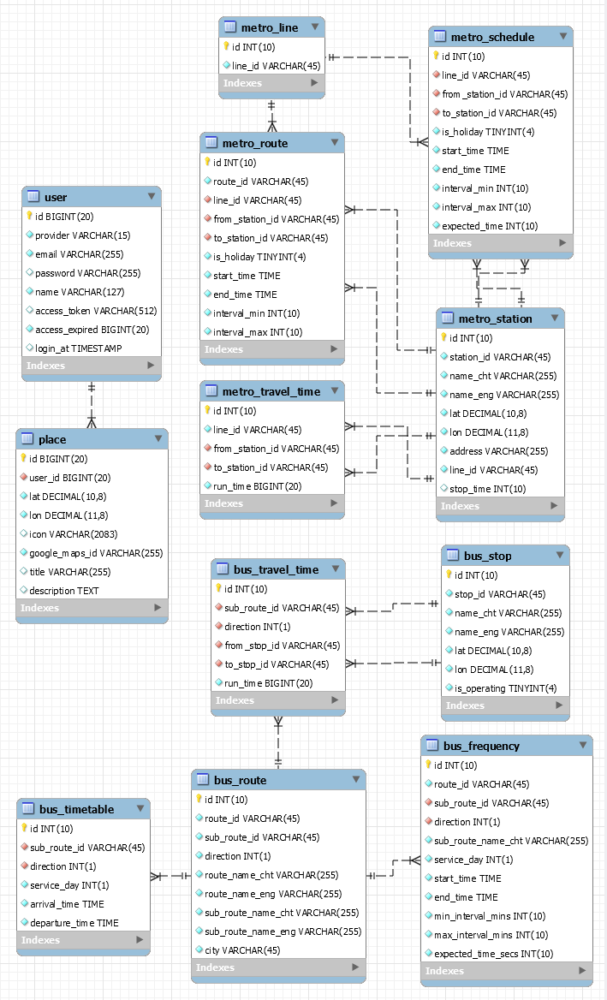

# Taipei Travel Time

A Map tool displays the reachable areas of given travel time and starting point via public transports in Taipei.

Website URL: https://taipeitraveltime.site

---

## Table of Contents
* [Technologies](#Technologies)
* [Architecture](#Architecture)
* [Demonstration](#Demonstration)
* [Database Schema](#Database-Schema)
* [Features](#Features)
* [Contact](#Contact)

## Technologies
### Back-End
* Node.js / Express
* RESTful API
* Nginx
### Front-End
* HTML
* CSS
* JavaScript
* jQuery
* Bootstrap
* AJAX
### Database
* MySQL
### Framework
* MVC
### Data Structures
* Directed Graph
* Priority Queue with Binary Heap
### Algorithm
* Dijkstra Algorithm
### Cloud Service (AWS)
* Elastic Compute Cloud (EC2)
* Relational Database Service (RDS)
* Simple Storage Service (S3)
* CloudFront
### Networking
* HTTPS
* SSL
* Domain Name System (DNS)
### Test
* Mocha
* Chai
* Artiliery
### 3rd Party APIs
* Facebook Login API
* Google Login API
* Google Maps APIs
### Data Source
* [Public Transport Data Exchange Platform](https://ptx.transportdata.tw)

## Architecture

## Database Schema

## Features
### Reachable region
Drag the pin to set the starting point.
Modify the options to fit the use case.
  * Travel Time:
    * The specified period of time spent on moving from the starting point to any other region.
  * Specified Transit Mode
    * Supported transits:
	     1. Taipei Metro system
	     2. Bus network of Greater Taipei Area.
  * Number of Transfer
    * The specified number of transfer between different routes or different transits.
  * Maximum Walking Distance
    * The maximum distance a passanger willing to walk from:
	     1. the starting point to the first transit station of the journey
	     2. the last transit station of the journey to its nearby area
  * Departure Time
    * The specified date and time to depart from the starting point.

 
### Place Info
  * Place Keyword Search
  * Destination Directions
  * Favorite Places

## Demo Account
> You don't need an account to use most of the functions. 
> The below account has some built-in pins on the map to demonstrate the favorite places feature.

  * Account: demo1@demo.com
  * Password: demo1

## Contact
Wei-Jun Hung @ weijunhung@outlook.com
